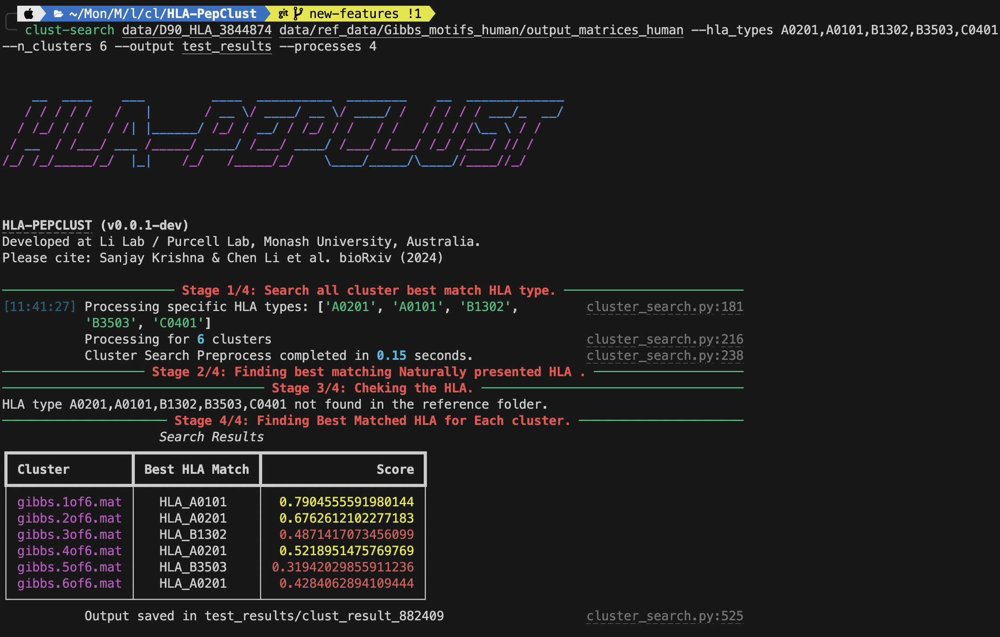

# HLA-PepClust  
  
  
  

## Introduction  

HLA-PepClust is a `CLI` tool designed for clustering peptide sequences based on their HLA binding motifs.  

## Prerequisites  

Ensure your system meets the following requirements:  
- Python **3.9 or higher**  
- `pip` (Python package manager)  

## Download or Clone the Repository  

```bash
git clone https://github.com/Sanpme66/HLA-PepClust.git
cd HLA-PepClust/
```

## Setting Up the Python Environment  

1. **Create a virtual environment**  
    ```bash
    python3 -m venv hlapepclust-env
    ```

2. **Activate the virtual environment**  
    - **macOS / Linux**:  
      ```bash
      source hlapepclust-env/bin/activate
      ```
    - **Windows**:  
      ```bash
      .\hlapepclust-env\Scripts\activate
      ```

3. **Upgrade `pip`**  
    ```bash
    pip install --upgrade pip
    ```

## Installing Dependencies  

1. **Navigate to the project directory** (if not already in it)  
    ```bash
    cd HLA-PepClust/
    ```

2. **Install the package and dependencies**  
    ```bash
    pip install -e .
    ```

## Running HLA-PepClust  

### Display Help Message  

To see available options and usage details:  
```bash
clust-search -h      
```

### Command Structure  

```bash
clust-search <input_data_path> <reference_data_path> \
  --hla_types <hla_types> \
  --n_clusters <number_of_clusters> \
  --output <output_path> \
  --species <Human or Mouse> \
  --threshold <similarity_threshold (default: 0.5)> \
  --log \
  --processes <number_of_threads>
```

### Example Usage  

```bash
clust-search data/D90_HLA_3844874 data/ref_data/Gibbs_motifs_human/output_matrices_human \
  --hla_types A0201,A0101,B1302,B3503,C0401 \
  --n_clusters 6 \
  --species human \
  --output test_results \
  --processes 4 \
  --threshold 0.6 
```

## Command Line Arguments  

| Argument | Type | Description | Default |
|----------|------|-------------|---------|
| `gibbs_folder` | `str` | Path to test folder containing matrices. | *Required* |
| `reference_folder` | `str` | Path to reference folder containing matrices. | *Required* |
| `-o, --output` | `str` | Path to output folder. | `"output"` |
| `-hla, --hla_types` | `list` | List of HLA types to search. | *All* |
| `-p, --processes` | `int` | Number of parallel processes to use. | `4` |
| `-n, --n_clusters` | `int` | Number of clusters to search for. | `"all"` |
| `-t, --threshold` | `float` | Motif similarity threshold. | `0.5` |
| `-s, --species` | `str` | Species to search [Human, Mouse]. | `"human"` |
| `-db, --database` | `str` | Generate a motif database from a configuration file. | `"data/config.json"` |
| `-k, --best_KL` | `bool` | Find the best KL divergence only. | `False` |
| `-l, --log` | `bool` | Enable logging. | `False` |
| `-im, --immunolyser` | `bool` | Enable immunolyser output. | `False` |
| `-c, --credits` | `bool` | Show credits for the motif database pipeline. | `False` |
| `-v, --version` | `bool` | Show the version of the pipeline. | `False` |

## Example Output  

Example of running the `clust-search` command:  

  

## Deactivating the Virtual Environment  

After finishing, deactivate the virtual environment with:  
```bash
deactivate
```

## Conclusion  

More detailed instructions coming soon... 🚀  

